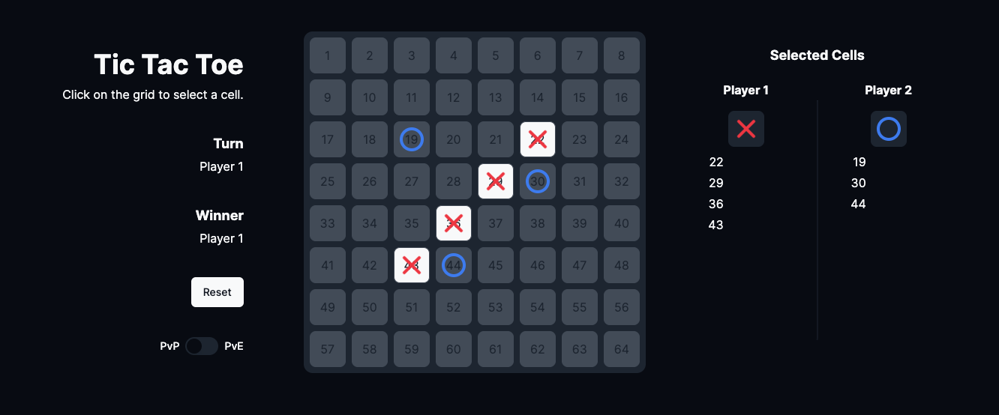
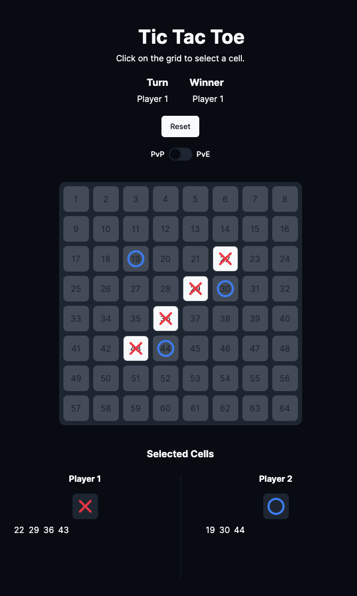

# Démarrage du projet

## Installation

Pour installer le projet, il suffit de cloner le dépôt et d'installer les dépendances avec les commande suivante:

```bash
git clone https://github.com/alexgr-school/dia3_solution-back.git

cd 4-tic-tac-toe/app
npm install

cd 4-tic-tac-toe/api
pip install -r requirements.txt
```

## Lancement

```bash
cd 4-tic-tac-toe/app
npm run dev

cd 4-tic-tac-toe/api
python main.py
```

## Utilisation

Frontend: [http://localhost:3000](http://localhost:3000)

Backend: [http://localhost:8080](http://localhost:8080)

### Mode de jeu

Pour changer de mode entre 1 VS 1 et 1 VS IA, il suffit de cliquer sur le switch en bas à gauche ou en haut au milieu suivant votre écran.

## Visuel



